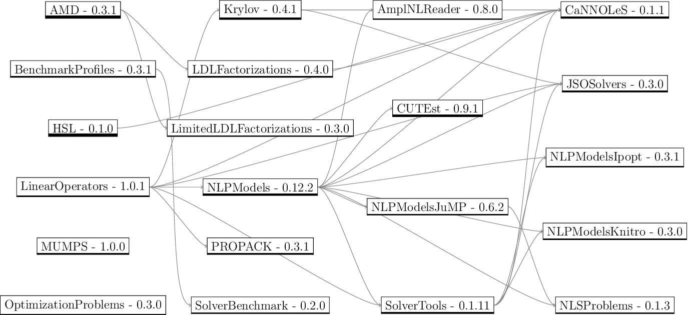

# Dependency Tree Generator for Julia Packages

Used in JuliaSmoothOptimizers, but could be useful for others.

Converted to `png` with

```bash
convert -density 150 deps.pdf -quality 90% deps.png
```


